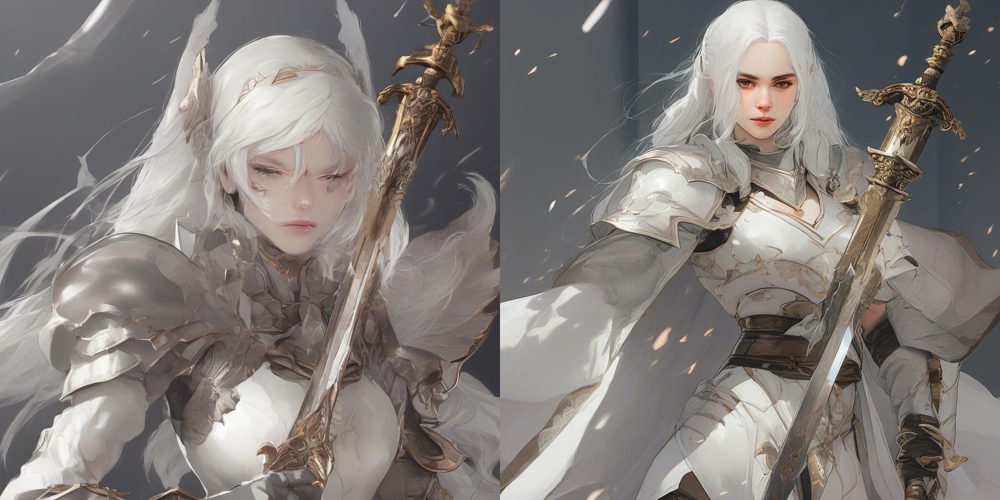

# FaceScore

<p align="center">
   📃 <a href="https://arxiv.org/abs/2406.17100" target="_blank">Paper</a> • 🤗 <a href="https://huggingface.co/AIGCer-OPPO/FaceScore" target="_blank">Checkpoints</a> 
</p>

**FaceScore: Benchmarking and Enhancing Face Quality in Human Generation**

Traditional facial quality assessment focuses on whether a face is suitable for recognition, while image aesthetic scorers emphasize overall aesthetics rather than details. FaceScore is the first reward model that focuses on faces in text-to-image models, designed to score the faces generated in images. It is fine-tuned on positive and negative sample pairs generated using an inpainting pipeline based on real face images and surpasses previous models in predicting human preferences for generated faces.

- [Install Dependency](#install-dependency)
- [Example Use](#example-use)
- [LoRA base on SDXL](#lora-based-on-sdxl)
- [Acknowledgement](#acknowledgement)
- [Citation](#citation)

## Install Dependency

```
pip install -r requirements.txt
```

## Example Use

We provide an example inference script in the directory of this repo. 
We also provide a real face image for testing. Note that the model can also score real face in the image, and no need to provide a specific prompt.


Use the following code to get the human preference scores from ImageReward:

```python
from FaceScore.FaceScore import FaceScore
import os 


face_score_model = FaceScore('FaceScore')
# load locally 
# face_score_model = FaceScore(path_to_checkpoint,med_config = path_to_config)

img_path = 'assets/Lecun.jpg'
face_score,box,confidences = face_score_model.get_reward(img_path)
print(f'The face score of {img_path} is {face_score}, and the bounding box of the face(s) is {box}')

```
You can also choose to load the model locally, after downloading the checkpoint in [FaceScore](https://huggingface.co/AIGCer-OPPO/FaceScore/tree/main).

The output should be like as follow (the exact numbers may be slightly different depending on the compute device):

```
The face score of assets/Lecun.jpg is 3.993915319442749, and the bounding box of the faces is [[104.02845764160156, 28.232379913330078, 143.57421875, 78.53730773925781]]
```


## LoRA based on SDXL
We leverage FaceScore to filter data and perform direct preference optimization on SDXL.
The LoRA weight is [here](https://huggingface.co/AIGCer-OPPO/FaceScore-dpo-SDXL-LoRA/tree/main).
Here we provide a quick example:
```
from diffusers import StableDiffusionXLPipeline, UNet2DConditionModel
import torch

# load pipeline
inference_dtype = torch.float16
pipe = StableDiffusionXLPipeline.from_pretrained(
    "stabilityai/stable-diffusion-xl-base-1.0",
    torch_dtype=inference_dtype,
)
vae = AutoencoderKL.from_pretrained(
    'madebyollin/sdxl-vae-fp16-fix',
    torch_dtype=inference_dtype,
)
pipe.vae = vae
# You can load it locally
pipe.load_lora_weights("AIGCer-OPPO/FaceScore-dpo-SDXL-LoRA")
pipe.to('cuda')

generator=torch.Generator(device='cuda').manual_seed(42)
image = pipe(
    prompt='A woman in a costume standing in the desert',
    guidance_scale=5.0,
    generator=generator,
    output_type='pil',
).images[0]
image.save('A woman in a costume standing in the desert.png')
```
We provide some examples generated by ours (right) and compare with the original SDXL (left) below.
<div style="display: flex; justify-content: space-around; text-align: center;">
    <div style="text-align: center;">
        
        <p>A woman in a costume standing in the desert. </p>
    </div>
    <div style="text-align: center;">
        
        <p>A woman wearing a blue jacket and scarf.</p>
    </div>
</div>
<div style="display: flex; justify-content: space-around; text-align: center;">
    <div style="text-align: center;">
        
        <p>A woman in a costume standing in the desert. </p>
    </div>
    <div style="text-align: center;">
        
        <p>A woman with black hair and a striped shirt.</p>
    </div>
</div>
<div style="display: flex; justify-content: space-around; text-align: center;">
    <div style="text-align: center;">
        
        <p>A woman with white hair and white armor is holding a sword. </p>
    </div>
    <div style="text-align: center;">
        
        <p>A woman with long black hair and a white shirt.</p>
    </div>
</div>

## Acknowledgement
Our codebase references the code from [ImageReward](https://github.com/THUDM/ImageReward). We extend our gratitude to the authors for open-sourcing their codes.

## Citation

```
@misc{liao2024facescorebenchmarkingenhancingface,
      title={FaceScore: Benchmarking and Enhancing Face Quality in Human Generation}, 
      author={Zhenyi Liao and Qingsong Xie and Chen Chen and Hannan Lu and Zhijie Deng},
      year={2024},
      eprint={2406.17100},
      archivePrefix={arXiv},
      primaryClass={cs.CV},
      url={https://arxiv.org/abs/2406.17100}, 
}
```